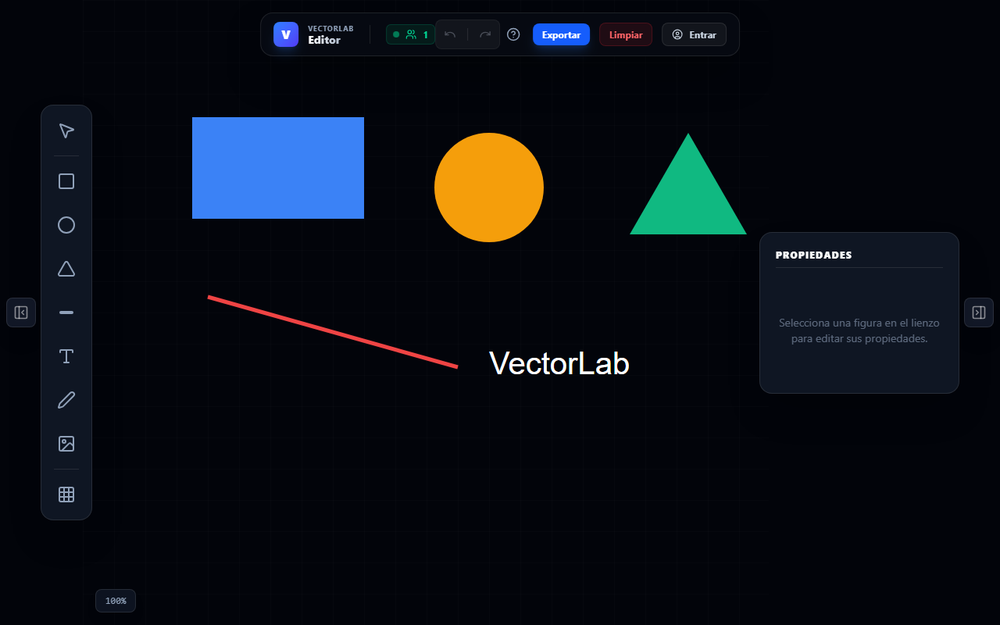
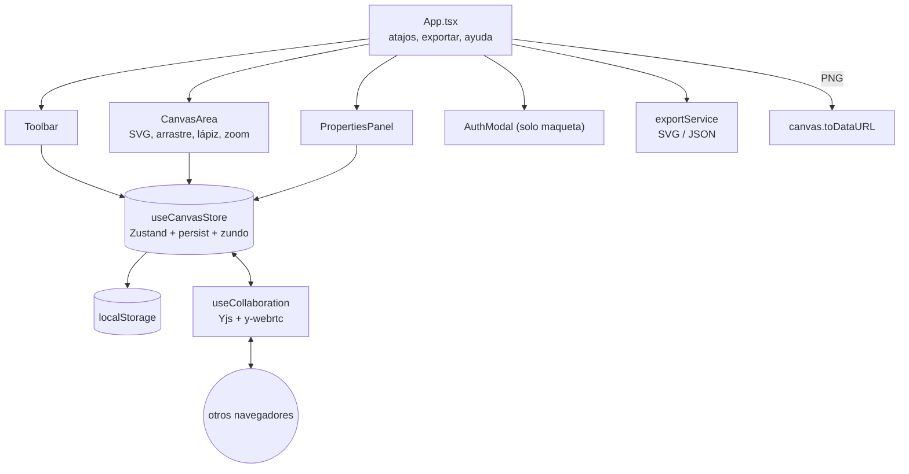

<div align="center">
  
  <h1>VectorLab</h1>
  <p><b>Editor de gráficos vectoriales SVG en el navegador, con historial, exportación y colaboración P2P experimental.</b></p>
  
  
  
  
  
  
  <p>
    <a href="#-inicio-rápido">Inicio rápido</a> ·
    <a href="#-características">Características</a> ·
    <a href="#-arquitectura">Arquitectura</a> ·
    <a href="#-pruebas">Pruebas</a> ·
    <a href="#-lo-que-todavía-no-existe">Limitaciones</a>
  </p>
</div>

VectorLab es una aplicación **frontend** (React + Zustand + SVG nativo) para dibujar figuras, moverlas, editar sus propiedades y exportar el resultado. Guarda el trabajo en el `localStorage` del navegador. **No es** un servicio con cuentas ni almacenamiento en la nube: no existe backend, y el modal de inicio de sesión es solo maqueta visual.

## 🎬 Vista rápida

<p align="center">
  
</p>

<sub>Captura real de la app en ejecución local, con figuras de ejemplo cargadas.</sub>

## ✨ Características

| Característica | Detalle |
| --- | --- |
| Figuras | Rectángulo, círculo, triángulo, línea, texto, trazo libre (lápiz) e imagen |
| Panel de propiedades | Color, posición, dimensiones/radio/extremo de línea, capas (al frente / al fondo) y eliminar |
| Historial | Deshacer/Rehacer con `Ctrl+Z`, `Ctrl+Shift+Z` y `Ctrl+Y` (middleware `zundo`) |
| Persistencia local | Estado guardado automáticamente en `localStorage` (`canvas-storage`) |
| Exportación | **SVG**, **JSON** y **PNG** (rasterizado desde el SVG) |
| Imágenes | Carga desde archivo, guardadas como base64 con **límite de 2 MB** (no hay compresión) |
| Snap a rejilla | Botón opcional en la barra de herramientas |
| Atajos | `Ctrl+C` / `Ctrl+V` (duplica la figura copiada), `Supr`/`Retroceso` para eliminar |
| Lienzo | Zoom con la rueda del ratón y desplazamiento con botón central, `Alt`+arrastre o `Shift`+arrastre; menú contextual (duplicar, capas, eliminar) |
| Robustez | `ErrorBoundary` que permite restablecer el estado local si los datos guardados se corrompen |
| Colaboración (experimental) | Sincronización de figuras con Yjs + WebRTC; ver limitaciones |

## 🏗️ Arquitectura



<details>
<summary>Estructura de carpetas</summary>

```text
src/
├── App.tsx                    # Cabecera, atajos globales, exportación PNG, ayuda
├── components/                # Toolbar, CanvasArea, PropertiesPanel, AuthModal, ErrorBoundary
├── services/exportService.ts  # Exportar a JSON y SVG
└── store/
    ├── useCanvasStore.ts      # Estado de figuras (Zustand + persist + zundo)
    └── useCollaboration.ts    # Sincronización Yjs/WebRTC
MANUAL.md                      # Manual de usuario (versión anterior, ver limitaciones)
```

</details>

## 🚀 Inicio rápido

| Requisito | Versión |
| --- | --- |
| Node.js | 22 (la que usa el CI) |
| npm | incluido con Node |

```bash
git clone https://github.com/Luiss2080/VectorLab.git
cd VectorLab
npm ci
npm run dev      # servidor de desarrollo de Vite
```

Otros comandos:

```bash
npm run build    # tsc -b + vite build
npm run lint     # oxlint
npm run test     # vitest run
```

## 🧪 Pruebas

`npm run test` ejecuta **11 pruebas** en 3 archivos (Vitest + Testing Library, entorno jsdom): el store del lienzo (5), la barra de herramientas (3) y el `ErrorBoundary` (3). El CI (`.github/workflows/ci.yml`) corre lint, build y tests con Node 22. **No** hay pruebas de `CanvasArea`, exportación ni colaboración.

## 🚧 Lo que todavía no existe

- **Sin cuentas ni nube:** `AuthModal` no envía nada a ningún servidor; "Iniciar sesión" y "Continuar con Github" no hacen nada.
- **Colaboración experimental:** usa una sala fija (`figuras-vectoriales-room`) y servidores de señalización públicos codificados en el código (`wss://signaling.yjs.dev` y uno en herokuapp, que pueden no estar disponibles). Cualquiera que abra la app en esa sala comparte el lienzo; no hay salas privadas, permisos ni cursores. Cada cambio reemplaza el arreglo completo de figuras, por lo que ediciones simultáneas pueden pisarse.
- Los identificadores de figura se generan con `Date.now()`; dos creaciones en el mismo milisegundo podrían colisionar.
- Sin selección múltiple, agrupación ni redimensionado con manejadores.
- `MANUAL.md` es anterior a varias funciones (menciona solo SVG/JSON al exportar).

## 📄 Licencia

Sin licencia definida: todos los derechos reservados por defecto (el README anterior afirmaba MIT, pero el repositorio no incluye archivo `LICENSE`).

<div align="center">
  <sub>Hecho por Luiss2080 · React, Zustand y Yjs</sub>
</div>
